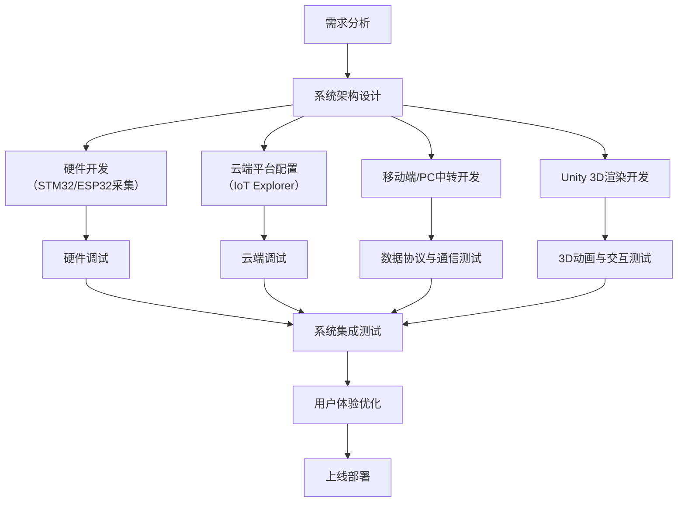
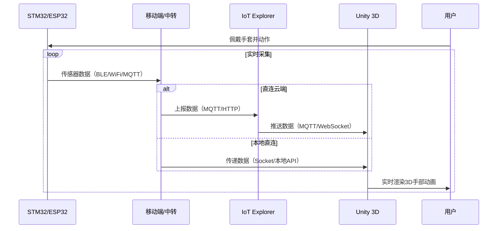
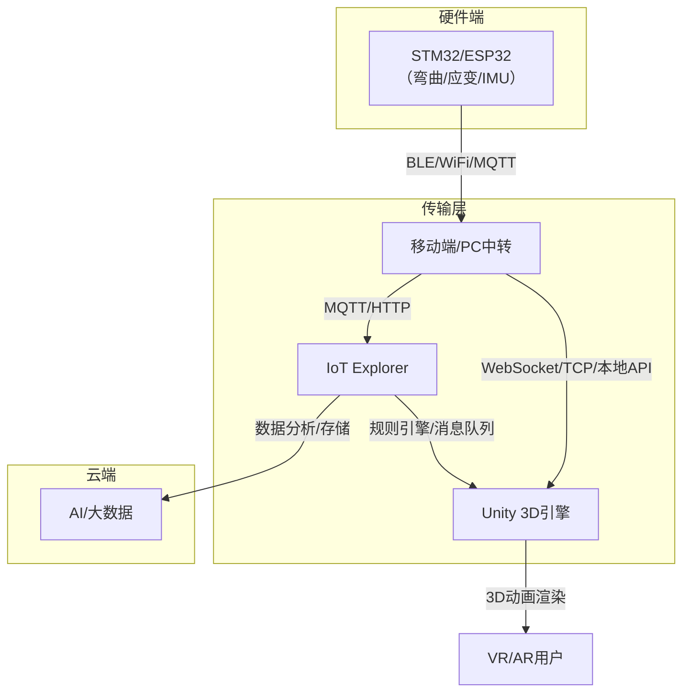
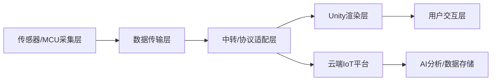
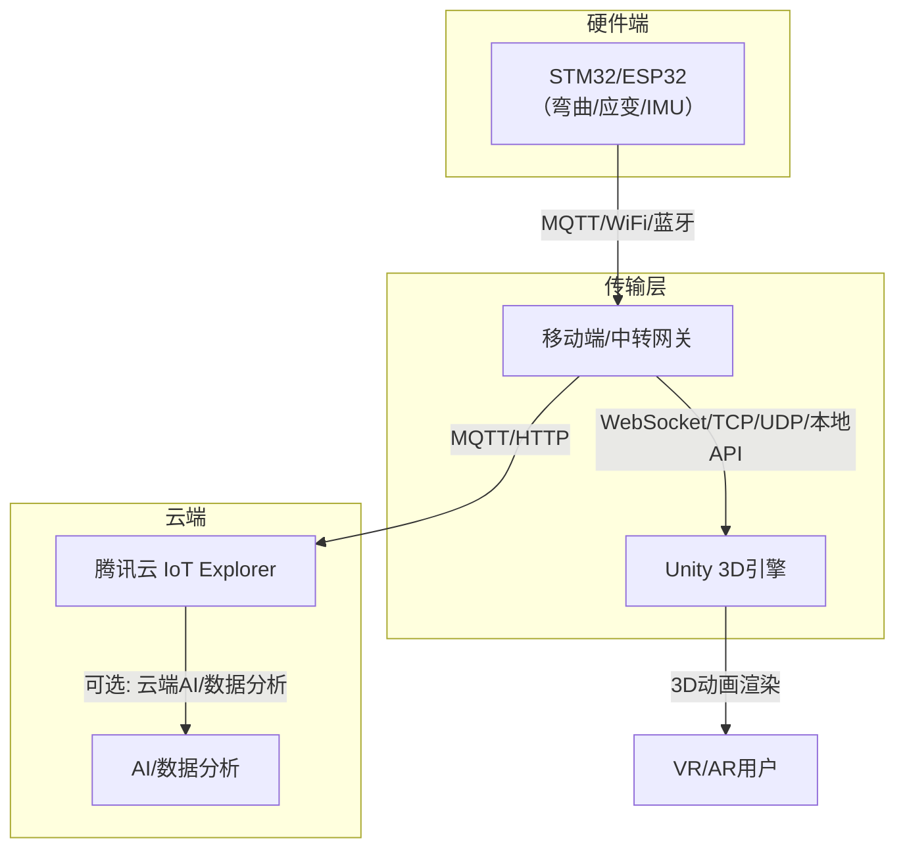

好的，以下为你的“基于IoT Explorer和Unity的跨平台VR/AR数据手套”项目设计关键UML/架构示意图，包括：  
1. 项目开发流程图  
2. 用例图  
3. 交互时序图  
4. 系统架构图  

---

### 1. 项目开发流程图



---

### 2. 用例图

```mermaid
usecase
  :用户: as User
  :开发者: as Dev
  :云平台: as Cloud

  User -- (佩戴数据手套)
  User -- (进行手部动作)
  User -- (在VR/AR中查看手部动画)
  User -- (远程升级/配置设备)
  Dev -- (开发硬件采集程序)
  Dev -- (开发Unity渲染模块)
  Dev -- (配置IoT云平台)
  Cloud -- (接收设备数据)
  Cloud -- (推送数据到Unity)
  Cloud -- (存储/分析手部数据)
```

---

### 3. 交互时序图（核心数据流）



---

### 4. 系统架构图



---

### 5. 组件分层结构（补充）



---

如需某一图的详细扩展（如用例细化、时序细化、Unity骨骼映射等），请随时告知！




