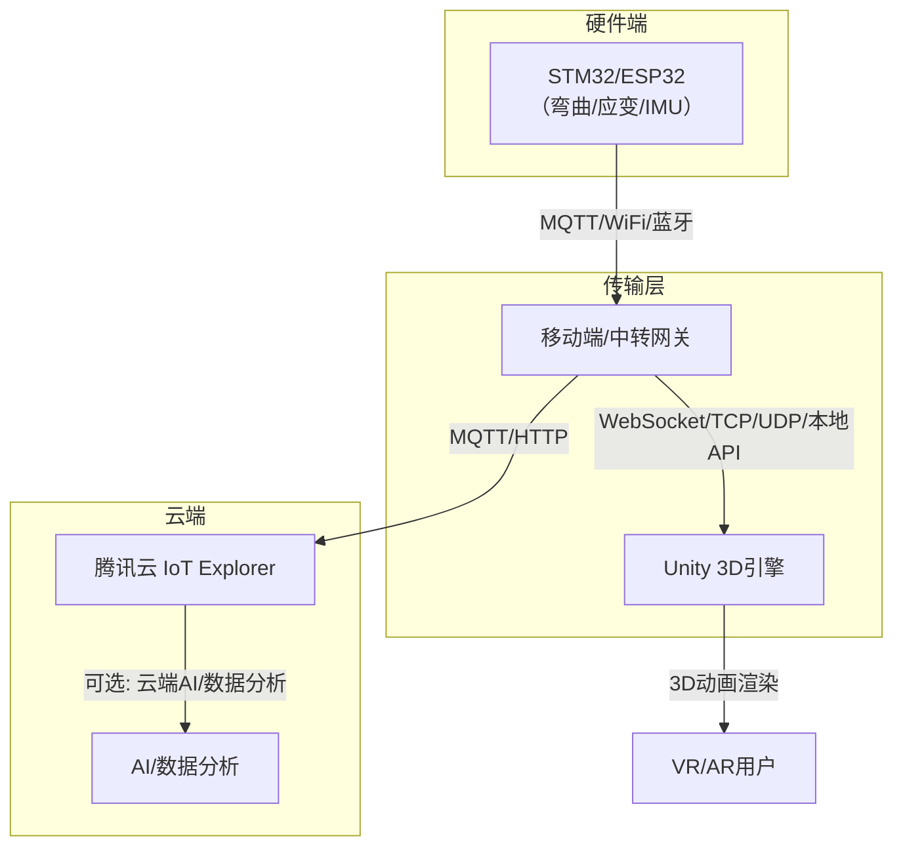
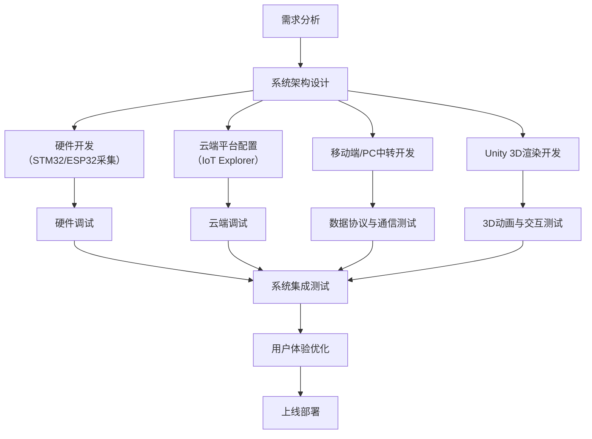
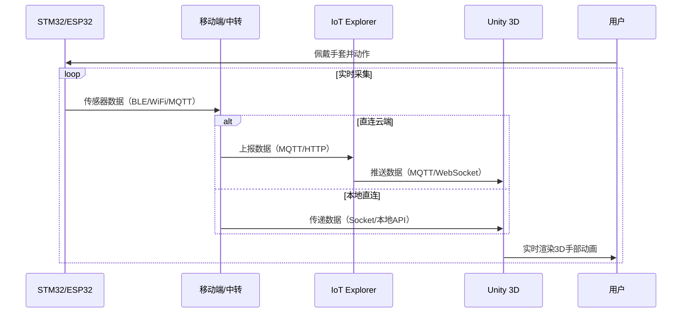
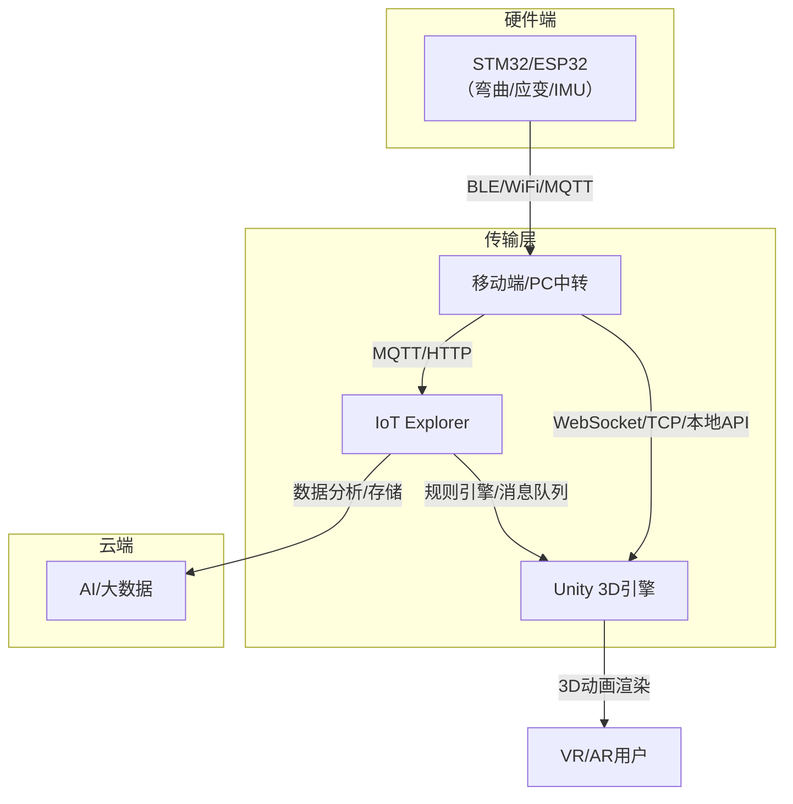
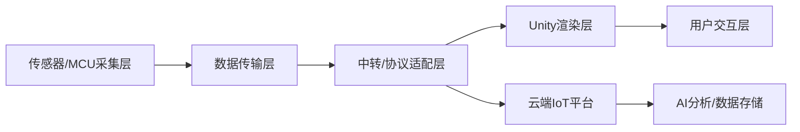

这是一款 基于ESP32、MPU6050、弯曲传感器的手语手势识别VR Unity数据手套项目，兼顾实时性、精度及Web调用需求，
特点需求如下：
- 用 IoT Explorer 作为物联网平台  
- 用 STM32/ESP32 采集手部传感器（弯曲、应变片、IMU）数据  
- 通过 MQTT/蓝牙/WiFi 等协议传输到移动端  
- 用 Unity 实时渲染手部 3D 动画，实现跨平台 VR/AR 数据手套  
- 希望有一份可行性设计方案

下面我为广大二次开发者详细梳理一套可行的系统架构与实现建议，结合 opengloves-ui-0.4.2 相关思路。

---

## 1. 系统总体架构



---

## 2. 关键技术点与可行性分析

### 2.1 下位机（STM32/ESP32）

- 采集弯曲、应变片、IMU等传感器数据，打包为手部姿态数据包
- 支持多协议：  
  - **WiFi/MQTT**：适合有网络环境，数据可直达云端或本地服务器  
  - **蓝牙BLE**：适合直连移动端，低延迟，适合本地实时渲染
- 推荐数据格式：JSON/二进制，包含每根手指的角度、IMU姿态等

### 2.2 移动端/中转网关

- 作用：  
  - 作为数据中转（蓝牙/WiFi → Unity/云端）
  - 可选：本地预处理、滤波、姿态融合
- 方案选择：  
  - **移动端App**（Android/iOS，推荐用 Unity/Flutter/原生开发）  
    - 负责接收下位机数据（蓝牙/WiFi/MQTT），并通过本地 API/Socket/Unity 插件传递给 Unity
  - **PC端中转**（如蓝牙适配器+本地服务，适合PC VR）

### 2.3 Unity端（3D渲染）

- 通过插件或 Socket/WebSocket 客户端实时接收手部数据
- 解析数据并驱动 3D 手部骨骼动画（可参考 opengloves-ui-0.4.2 的数据结构和动画驱动方式）
- 支持多平台（PC VR、移动 VR、AR 眼镜等）

### 2.4 云端（IoT Explorer）

- 设备注册、数据上报、远程管理
- 可选：云端AI分析、数据存储、远程调试
- 通过规则引擎/消息队列将数据推送到需要的服务

---

## 3. 具体实现建议

### 3.1 数据协议设计

- 建议采用简洁的 JSON 或二进制协议，内容包括：
  ```json
  {
    "timestamp": 1680000000,
    "fingers": [angle0, angle1, angle2, angle3, angle4],
    "imu": {
      "roll": 0.0,
      "pitch": 0.0,
      "yaw": 0.0,
      "acc": [x, y, z],
      "gyro": [x, y, z]
    }
  }
  ```
- 也可参考 opengloves 的数据包格式

### 3.2 Unity端数据接入

- **蓝牙/WiFi直连**：  
  - Unity 支持 BLE 插件（如 [Unity Bluetooth LE](https://assetstore.unity.com/packages/tools/network/bluetooth-le-for-ios-tvos-and-android-26661)）
  - WiFi 可用 Socket/TCP/UDP 方式接收数据
- **MQTT接入**：  
  - Unity 有 MQTT 客户端库（如 [M2Mqtt](https://github.com/eclipse/paho.mqtt.m2mqtt)）
  - 直接订阅云端/本地 MQTT Broker 的数据主题
- **数据驱动动画**：  
  - 解析数据后，映射到 3D 手部骨骼（可参考 opengloves-ui-0.4.2 的骨骼映射逻辑）
  - 支持多种手型、姿态实时渲染

### 3.3 云端对接

- 设备通过 IoT Explorer 注册、鉴权、数据上报
- 可用规则引擎将数据转发到云函数/AI服务/数据库
- 支持远程固件升级、参数下发

---

## 4. 参考开源项目与资料

- [opengloves-ui-0.4.2](https://github.com/OpenGloves/opengloves-ui)（手部数据协议、骨骼动画驱动）
- [腾讯云 IoT Explorer](https://cloud.tencent.com/product/iotexplorer)
- [Unity BLE 插件](https://assetstore.unity.com/packages/tools/network/bluetooth-le-for-ios-tvos-and-android-26661)
- [Unity MQTT 客户端](https://github.com/eclipse/paho.mqtt.m2mqtt)
- [ESP32 MQTT 示例](https://github.com/espressif/arduino-esp32/tree/master/libraries/MQTT)

---

## 5. 典型数据流与开发流程

1. **下位机采集**：STM32/ESP32 采集手部数据，打包发送
2. **数据传输**：通过 BLE/WiFi/MQTT 发送到移动端/PC/云端
3. **Unity接收**：Unity 端通过 BLE/MQTT/Socket 实时接收数据
4. **3D渲染**：解析数据，驱动 3D 手部骨骼动画
5. **云端管理**：IoT Explorer 设备管理、数据分析、远程控制

---

## 6. 可行性总结

- **技术成熟**：各环节均有成熟方案和开源实现
- **跨平台**：Unity 支持多平台，IoT Explorer 支持多协议
- **实时性**：BLE/WiFi/MQTT 均可满足 VR/AR 实时性需求
- **可扩展性**：可后续扩展 AI 手势识别、云端数据分析等功能

---
附录：“基于IoT Explorer和Unity的跨平台VR/AR数据手套”项目设计关键UML/架构示意图，包括：  
1. 项目开发流程图  
2. 用例图  
3. 交互时序图  
4. 系统架构图  

---

### 1. 项目开发流程图



---

### 2. 用例图


暂无

---

### 3. 交互时序图（核心数据流）



---

### 4. 系统架构图



---

### 5. 组件分层结构（补充）



---

如需某一图的详细扩展（如用例细化、时序细化、Unity骨骼映射等），请随时告知！

如（如 Unity 端数据接入、下位机代码、数据协议、opengloves-ui-0.4.2 的骨骼映射等）
