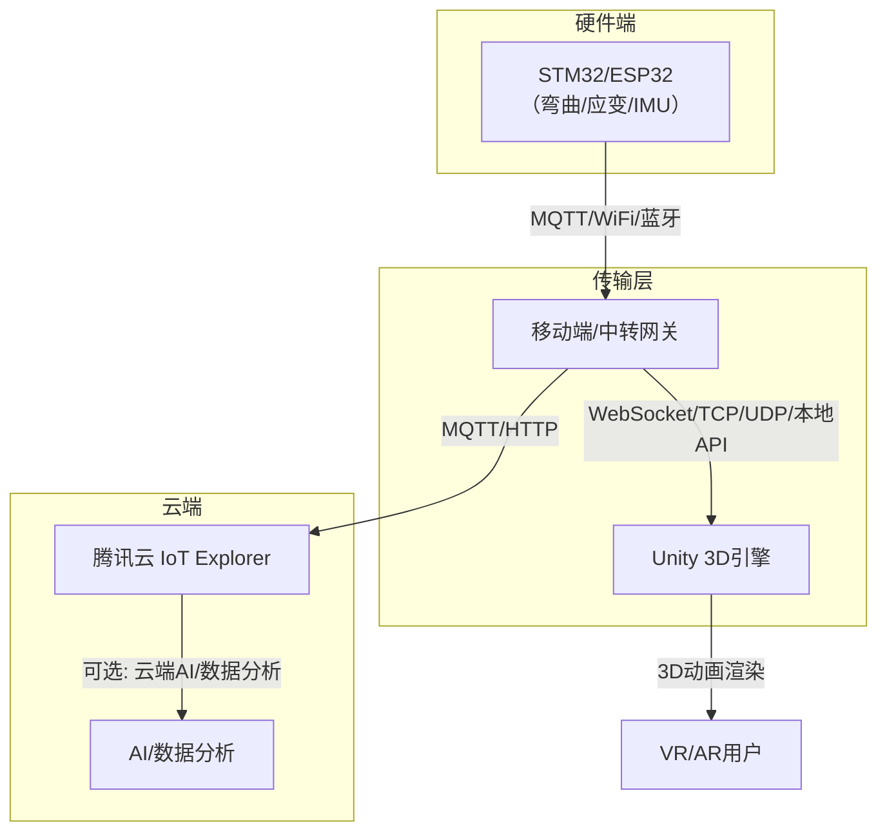
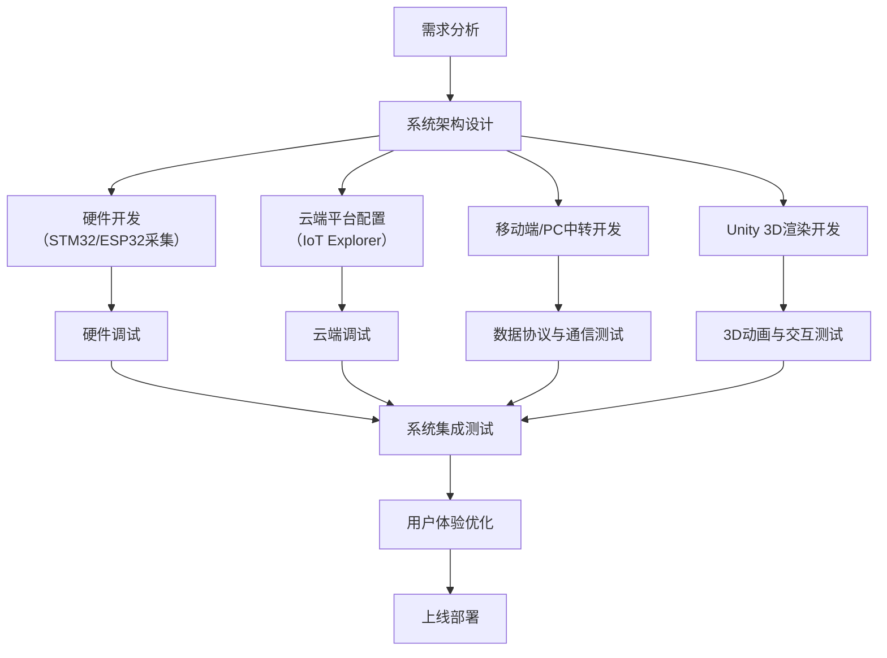
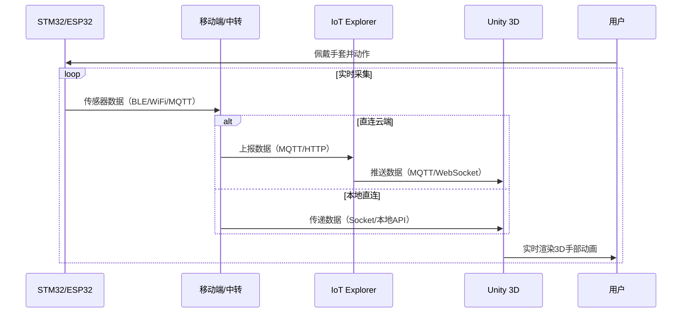
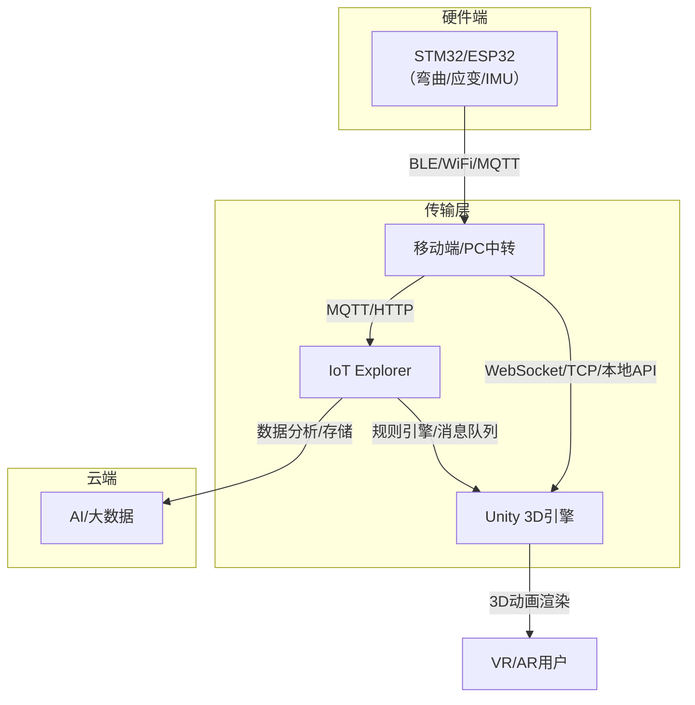
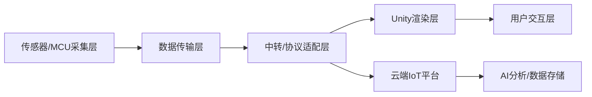

项目简介：这是一款基于ESP32、MPU6050、弯曲传感器的手语手势识别VR Unity数据手套项目，兼顾实时性、精度及Web调用需求，
LapinEX 无障碍数据手套AIoT系统，获2025全国大学生计算机设计大赛江苏省特等奖、首届ASUS IoT开发者大赛杰出奖。它是个面向言语障碍人群，集成了听障人群交互通讯、远程康复云、具身智能可视化的全天候一体化平台。项目创新突破传统手语识别设备的单模态局限、达到毫秒级实时响应与多模态手语翻译静态高精度识别，支持Unity虚拟手同步实时渲染、数据上云可追溯与分析，解决听障人群沟通效率低、设备成本高、场景适配差的行业痛点。

 
 项目由LapinEX灵兔共语（南京）科技有限公司-南京特殊教育师范学院-70x工作室联合发起，预计2025年9月完成第一版发布
 工程项目核心开发成员：韩棒 黄浦城 汪胡阳 孙潞韬 项怀锋 詹孙萌 张玉静 张子月（按形式首字母排序）
侵权必责

项目特点如下：
- 用 IoT Explorer 作为物联网平台  
- 用 STM32/ESP32 采集手部传感器（弯曲、应变片、IMU）数据  
- 通过 MQTT/蓝牙/WiFi 等协议传输到移动端  
- 用 Unity 实时渲染手部 3D 动画，实现跨平台 VR/AR 数据手套  

下面我为广大二次开发者详细梳理一套可行的系统架构与实现建议，结合了 opengloves-ui-0.4.2 等相关思路。

---

## 1. 系统总体架构和整体解决方案框架
### 1. 硬件与数据链路
• 硬件架构：
• ESP32作为主控，同步采集5-6个弯曲传感器（手指弯曲度）和MPU6050（手腕加速度/角速度）数据，采样频率50-100Hz。
• 数据通过蓝牙或Wi-Fi发送至PC，经预处理后输入模型推理，结果实时同步到Unity（WebGL导出，支持浏览器调用）。
• 数据流程：
传感器原始数据 → 预处理（清洗、标准化） → 特征工程 → 模型推理 → Unity动作/文本映射 → Web实时交互。
### 2. 数据采集与标注
• 采集内容：每组手势包含时序序列（长度50-100帧），单帧数据含：弯曲传感器电阻值（5-6维）+ MPU6050的6轴数据（6维），共11-12维特征。
• 标注工具：用Python+PyQt开发简易工具，实时显示传感器数据并手动标记手势类别（如“你好”“谢谢”等，建议覆盖20-50种常用手语）。
• 数据集规模：每种手势采集300-500组（含不同用户、手部姿态），划分训练集（80%）、验证集（10%）、测试集（10%）。
### 3. 特征工程与预处理

• 预处理：
• 异常值处理：滑动窗口（窗口大小3-5）平滑噪声，剔除传感器跳变值（如弯曲传感器读数>90%量程）。
• 标准化：将所有特征归一化至[0,1]区间（消除量纲差异）。
• 特征提取：
• 时域特征：每帧数据的均值、方差、峰值（反映手指弯曲幅度和手腕运动强度）；
• 时序特征：相邻帧差值的均值（反映手势变化速率），如“握拳”到“张开”的速度。

### 4. 模型选择与训练
• 核心需求：实时性（推理延迟<50ms，满足Web交互）、精度（常用手势识别率>90%）、模型轻量化（适配Web端部署）。




---

## 2. 关键技术点与可行性分析

### 2.1 下位机（STM32/ESP32）

- 采集弯曲、应变片、IMU等传感器数据，打包为手部姿态数据包
- 支持多协议：  
  - **WiFi/MQTT**：适合有网络环境，数据可直达云端或本地服务器  
  - **蓝牙BLE**：适合直连移动端，低延迟，适合本地实时渲染
- 推荐数据格式：JSON/二进制，包含每根手指的角度、IMU姿态等

### 2.2 移动端/中转网关

- 作用：  
  - 作为数据中转（蓝牙/WiFi → Unity/云端）
  - 可选：本地预处理、滤波、姿态融合
- 方案选择：  
  - **移动端App**（Android/iOS，推荐用 Unity/Flutter/原生开发）  
    - 负责接收下位机数据（蓝牙/WiFi/MQTT），并通过本地 API/Socket/Unity 插件传递给 Unity
  - **PC端中转**（如蓝牙适配器+本地服务，适合PC VR）

### 2.3 Unity端（3D渲染）

- 通过插件或 Socket/WebSocket 客户端实时接收手部数据
- 解析数据并驱动 3D 手部骨骼动画（可参考 opengloves-ui-0.4.2 的数据结构和动画驱动方式）
- 支持多平台（PC VR、移动 VR、AR 眼镜等）

### 2.4 云端（IoT Explorer）

- 设备注册、数据上报、远程管理
- 可选：云端AI分析、数据存储、远程调试
- 通过规则引擎/消息队列将数据推送到需要的服务

---


## 3. 数据流具体实现

### 3.1 数据协议设计

- 建议采用简洁的 JSON 或二进制协议，内容包括：
  ```json
  {
    "timestamp": 1680000000,
    "fingers": [angle0, angle1, angle2, angle3, angle4],
    "imu": {
      "roll": 0.0,
      "pitch": 0.0,
      "yaw": 0.0,
      "acc": [x, y, z],
      "gyro": [x, y, z]
    }
  }
  ```
- 也可参考 opengloves 的数据包格式

### 3.2 Unity端数据接入

- **蓝牙/WiFi直连**：  
  - Unity 支持 BLE 插件（如 [Unity Bluetooth LE](https://assetstore.unity.com/packages/tools/network/bluetooth-le-for-ios-tvos-and-android-26661)）
  - WiFi 可用 Socket/TCP/UDP 方式接收数据
- **MQTT接入**：  
  - Unity 有 MQTT 客户端库（如 [M2Mqtt](https://github.com/eclipse/paho.mqtt.m2mqtt)）
  - 直接订阅云端/本地 MQTT Broker 的数据主题
- **数据驱动动画**：  
  - 解析数据后，映射到 3D 手部骨骼（可参考 opengloves-ui-0.4.2 的骨骼映射逻辑）
  - 支持多种手型、姿态实时渲染

### 3.3 云端对接

- 设备通过 IoT Explorer 注册、鉴权、数据上报
- 可用规则引擎将数据转发到云函数/AI服务/数据库
- 支持远程固件升级、参数下发

---

## 4. 参考开源项目与资料

- [opengloves-ui-0.4.2](https://github.com/OpenGloves/opengloves-ui)（手部数据协议、骨骼动画驱动）
- [腾讯云 IoT Explorer](https://cloud.tencent.com/product/iotexplorer)
- [Unity BLE 插件](https://assetstore.unity.com/packages/tools/network/bluetooth-le-for-ios-tvos-and-android-26661)
- [Unity MQTT 客户端](https://github.com/eclipse/paho.mqtt.m2mqtt)
- [ESP32 MQTT 示例](https://github.com/espressif/arduino-esp32/tree/master/libraries/MQTT)

多模态数据手套开源仓库友情链接：
- https://github.com/stefan-spiss/MagicWand-TFLite-ESP32-MPU6050
- https://github.com/haimianying/Hand-Gesture-Recognition?tab=readme-ov-file
- https://github.com/ShasinTheekshan/ESP32-Motion-Detection-System

---

## 5. 数据流与开发流程

1. **下位机采集**：STM32/ESP32 采集手部数据，打包发送
2. **数据传输**：通过 BLE/WiFi/MQTT 发送到移动端/PC/云端
3. **Unity接收**：Unity 端通过 BLE/MQTT/Socket 实时接收数据
4. **3D渲染**：解析数据，驱动 3D 手部骨骼动画
5. **云端管理**：IoT Explorer 设备管理、数据分析、远程控制

---

## 6. 可行性总结

- **技术成熟**：各环节均有成熟方案和开源实现
- **跨平台**：Unity 支持多平台，IoT Explorer 支持多协议
- **实时性**：BLE/WiFi/MQTT 均可满足 VR/AR 实时性需求
- **可扩展性**：可后续扩展 AI 手势识别、云端数据分析等功能

---

## 7.机器学习和模型训练部署
基于ESP32、MPU6050、弯曲传感器的手语手势识别VR Unity数据手套解决方案，需兼顾实时性、精度及Web调用需求，以下是具体方案及Transformer与LSTM的选择分析：

### 一、Transformer与LSTM的对比与选择

1. LSTM（长短期记忆网络）
• 优势：
• 专为时序数据设计，能捕捉手势的连续动态特征（如手指弯曲的先后顺序），计算量小，推理速度快（单样本延迟<10ms）。
• 模型轻量化易实现，可压缩为TensorFlow Lite格式（<1MB），适配Web端（如TensorFlow.js部署）。
• 劣势：
• 对长时序依赖（如复杂多步骤手势）捕捉能力有限，易遗漏全局特征（如手指间的协同关系）。
• 适用场景：
• 手势以短时序动作为主（如单音节手语、静态手势），类别数<50种，优先保证实时性和Web端轻量化部署。
2. Transformer（基于自注意力机制）
• 优势：
• 自注意力机制能捕捉手势序列中全局依赖（如拇指与食指的配合关系），对复杂长时序手势（如多音节句子）识别精度更高。
• 可并行计算，训练效率优于LSTM（适合大规模数据集）。
• 劣势：
• 计算量极大（单样本推理延迟>50ms），模型体积大（基础版>10MB），Web端实时部署难度高（需重度优化）。
• 适用场景：
• 手势包含复杂多步骤动作（如连续手语句子），类别数>50种，且可接受稍高延迟（如100ms内），需牺牲部分实时性换取精度。
3. 最终选择建议
• 优先选LSTM：
手语手势多为短时序动作（单手势持续0.5-2秒，对应25-200帧数据），LSTM足以捕捉关键动态特征，且能满足Web端实时推理需求（延迟<30ms）。
若需提升精度，可采用LSTM+注意力机制（简化版Transformer），在保留轻量性的同时增强全局特征捕捉能力。

### 二、模型训练与Web部署
1. 模型训练细节
• LSTM模型结构：
 输入：(样本数, 时间步, 特征数) = (N, 50, 11)
'''
model = Sequential([
    LSTM(64, input_shape=(50, 11)),  # 提取时序特征
    Dropout(0.2),
    Dense(32, activation='relu'),
    Dense(classes, activation='softmax')  # classes为手势类别数
])
model.compile(optimizer='adam', loss='sparse_categorical_crossentropy', metrics=['accuracy'])
'''
• 训练优化：
• 用早停法（EarlyStopping）防止过拟合，训练轮次30-50轮；
• 转换为TensorFlow.js格式（tensorflowjs_converter工具），适配Web端推理。
2. Web与Unity集成
• Unity端：
• 通过C#脚本接收模型推理结果，映射为虚拟手动画或文本（如“你好”→ 虚拟人物挥手+文字显示）。
• 导出为WebGL格式，支持浏览器直接调用（需优化加载速度，压缩模型体积）。

• Web调用：
• 前端页面通过JavaScript调用TensorFlow.js模型，实时接收传感器数据并推理，结果通过WebSocket同步到Unity WebGL应用。

### 三、关键工具与开源资源
• 数据采集标注：
• 开源工具：Label Studio（支持时序数据标注，https://labelstud.io/）；
• 自定义脚本：用Python+Pyserial读取ESP32数据，结合pandas存储为CSV。
• 模型部署：
• TensorFlow.js（Web端推理，https://www.tensorflow.org/js）；
• Unity WebGL部署文档（https://docs.unity3d.com/Manual/webgl-gettingstarted.html）。
总结
• 推荐模型：优先选择LSTM，平衡实时性与Web端部署需求，适合大多数手语手势识别场景；若需处理复杂长时序手势，可尝试轻量化Transformer变体（如TinyBERT改造的时序模型），但需额外优化推理速度。
• 核心目标：通过LSTM实现低延迟（<50ms）、高准确率（>90%）的推理，结合Unity WebGL导出，最终实现浏览器可直接调用的实时手语交互应用。

附录：“基于IoT Explorer和Unity的跨平台VR/AR数据手套”项目设计关键UML/架构示意图，包括：  
1. 项目开发流程图  
2. 用例图  
3. 交互时序图  
4. 系统架构图  

---

### 1. 项目开发流程图



---

### 2. 用例图


暂无

---

### 3. 交互时序图（核心数据流）



---

### 4. 系统架构图



---

### 5. 组件分层结构（补充）



---

待拓展:（如用例细化、时序细化、Unity骨骼映射等）

（如 Unity 端数据接入、下位机代码、数据协议、opengloves-ui-0.4.2 的骨骼映射等）
