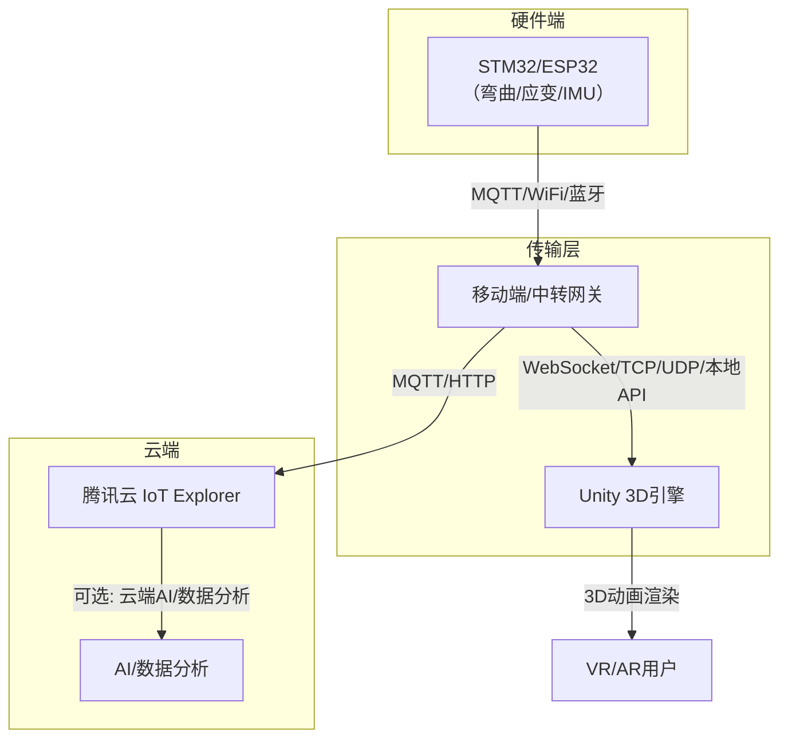
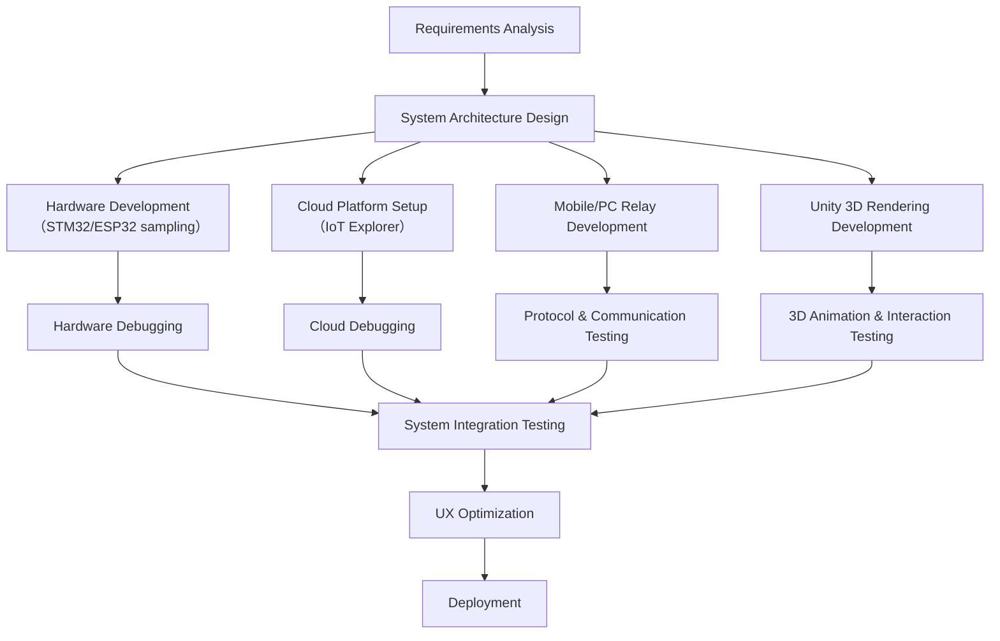
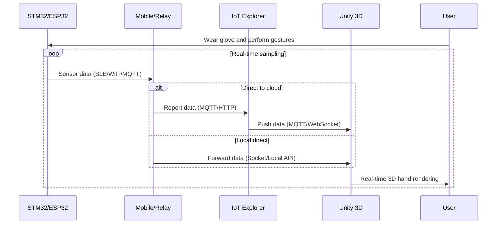
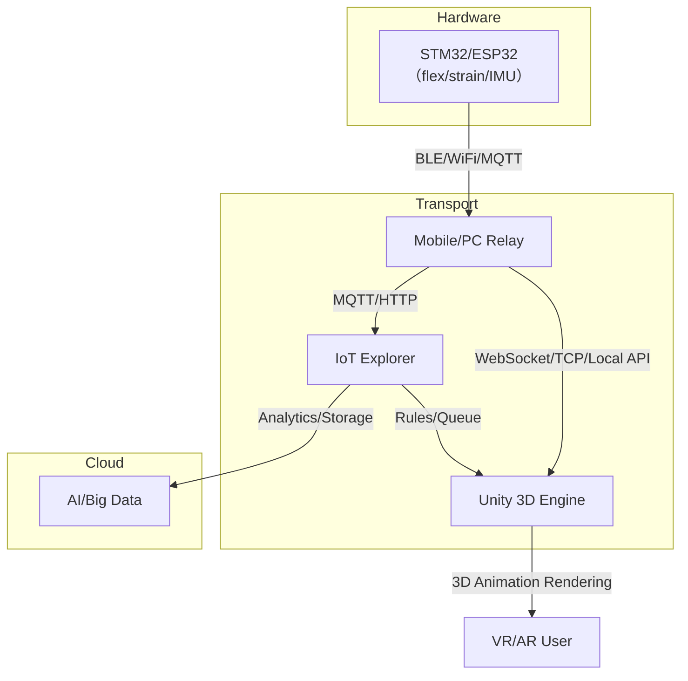
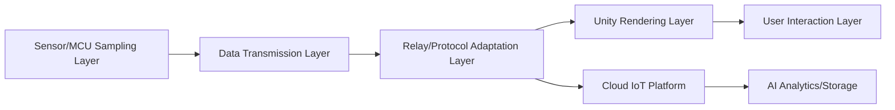

Project Introduction: This is a sign-language gesture recognition VR Unity data glove project based on ESP32, MPU6050, and flex (bending) sensors, balancing real-time performance, accuracy, and Web-call requirements. LapinEX Barrier-free Data Glove AIoT System, awarded the 2025 National College Students Computer Design Competition Jiangsu Province First Prize and the 1st ASUS IoT Developer Contest Outstanding Award. It is aimed at people with speech impairments and integrates hearing-impaired-related [...] 

The project was jointly initiated by LapinEX Lingtu Gongyu (Nanjing) Technology Co., Ltd. - Nanjing Special Education Normal College - 70x Studio. The first release is expected by September 2025.
Core engineering development members: Han Bang, Huang Pucheng, Wang Huyang, Sun Lutao, Tang Huaifeng, Zhan Sunmeng, Zhang Yujing, Zhang Ziyue (sorted by surname initial)
Infringement will be held accountable

Project features:
- Use IoT Explorer as the IoT platform  
- Use STM32/ESP32 to collect hand sensors (flex/bending, strain gauge, IMU) data  
- Transmit via MQTT/Bluetooth/WiFi to mobile/PC, preprocess and feed into model inference, results synchronize to Unity in real time  
- Use Unity for real-time 3D hand animation rendering, enabling cross-platform VR/AR data glove

Below I have organized a feasible system architecture and implementation suggestions for secondary developers, combining ideas from repositories such as opengloves-ui-0.4.2.

---

## 1. Overall System Architecture and Solution Framework
### 1. Hardware and Data Link
• Hardware architecture:
• ESP32 as the main controller, synchronously sampling 5-6 flex sensors (finger bend) and an MPU6050 (wrist acceleration/angular velocity), sampling frequency 50-100Hz.
• Data is sent to a PC via Bluetooth or Wi-Fi, preprocessed, then input to model inference, and results are synchronized to Unity (WebGL export, supporting browser calls).
• Data flow:
Sensor raw data → Preprocessing (cleaning, normalization) → Feature engineering → Model inference → Unity action/text mapping → Web real-time interaction.
### 2. Data Collection and Labeling
• Collected content: each gesture consists of a time-series sequence (length 50-100 frames). A single frame contains: flex sensor resistance values (5-6 dims) + MPU6050 6-axis data (6 dims), total 11-12 feature dimensions.
• Labeling tool: develop a simple tool in Python + PyQt to display sensor data in real time and manually tag gesture classes (e.g., "hello", "thanks"). It is recommended to cover 20-50 common sign language gestures.
• Dataset scale: collect 300-500 samples per gesture (including different users and hand postures), split into training (80%), validation (10%), and test (10%).
### 3. Feature Engineering and Preprocessing

• Preprocessing:
• Outlier handling: smoothing with a sliding window (window size 3-5) to reduce noise; remove sensor jump values (e.g., flex sensor reading > 90% of range).
• Normalization: scale all features to [0,1] (to remove unit differences).
• Feature extraction:
• Time-domain features: per-frame mean, variance, peaks (reflecting finger bend range and wrist motion intensity);
• Temporal features: mean of adjacent-frame differences (reflecting gesture change rate), e.g., speed from "fist" to "open".

### 4. Model Selection and Training
• Core requirements: real-time (inference latency <50ms to meet Web interaction), accuracy (common gesture recognition rate >90%), lightweight model (suitable for Web deployment).



---

## 2. Key Technical Points and Feasibility Analysis

### 2.1 Lower-level MCU (STM32/ESP32)

- Collect flex, strain gauge, IMU and other sensor data, package into a hand-pose data packet
- Support multiple protocols:
  - WiFi/MQTT: suitable when a network is available; data can go to cloud or local server
  - Bluetooth BLE: suitable for direct connection to mobile devices; low latency; suitable for local real-time rendering
- Recommended data formats: JSON/binary, containing each finger angle, IMU pose, etc.

### 2.2 Mobile/Relay Gateway

- Role:
  - Acts as data relay (BLE/WiFi → Unity/cloud)
  - Optional: local preprocessing, filtering, pose fusion
- Options:
  - Mobile App (Android/iOS, recommended Unity/Flutter/native): receives lower-level data (BLE/WiFi/MQTT) and forwards to Unity via local API/Socket/Unity plugin
  - PC-side relay (e.g., Bluetooth adapter + local service), suitable for PC VR

### 2.3 Unity (3D Rendering)

- Use plugin or Socket/WebSocket client to receive hand data in real time
- Parse data and drive 3D hand skeleton animation (refer to opengloves-ui-0.4.2 for data structure and animation-driving method)
- Support multiple platforms (PC VR, mobile VR, AR glasses)

### 2.4 Cloud (IoT Explorer)

- Device registration, data reporting, remote management
- Optional: cloud AI analysis, data storage, remote debugging
- Use rules/queues to forward data to necessary services

---

## 3. Concrete Data Flow Implementation

### 3.1 Data Protocol Design

- Suggest using simple JSON or binary protocol, containing:
  ```json
  {
    "timestamp": 1680000000,
    "fingers": [angle0, angle1, angle2, angle3, angle4],
    "imu": {
      "roll": 0.0,
      "pitch": 0.0,
      "yaw": 0.0,
      "acc": [x, y, z],
      "gyro": [x, y, z]
    }
  }
  ```
- Can also refer to opengloves packet format

### 3.2 Unity Data Ingestion

- Direct BLE/WiFi:
  - Unity supports BLE plugins (e.g., Unity Bluetooth LE)
  - WiFi can use Socket/TCP/UDP reception
- MQTT ingestion:
  - Unity has MQTT client libraries (e.g., M2Mqtt)
  - Subscribe to topics on cloud/local MQTT broker
- Data-driven animation:
  - After parsing, map data to 3D hand skeleton (see opengloves-ui-0.4.2 mapping logic)
  - Support multiple hand models and real-time rendering

### 3.3 Cloud Integration

- Devices register and authenticate via IoT Explorer, and report data
- Use rules to forward data to cloud functions/AI services/databases
- Support OTA firmware update and parameter dispatch

---

## 4. Reference Open Source Projects & Resources

- [opengloves-ui-0.4.2](https://github.com/OpenGloves/opengloves-ui) (hand data protocol, skeleton animation driving)
- [Tencent Cloud IoT Explorer](https://cloud.tencent.com/product/iotexplorer)
- [Unity BLE plugin](https://assetstore.unity.com/packages/tools/network/bluetooth-le-for-ios-tvos-and-android-26661)
- [Unity MQTT client](https://github.com/eclipse/paho.mqtt.m2mqtt)
- [ESP32 MQTT examples](https://github.com/espressif/arduino-esp32/tree/master/libraries/MQTT)

Multimodal data glove open repo links:
- https://github.com/stefan-spiss/MagicWand-TFLite-ESP32-MPU6050
- https://github.com/haimianying/Hand-Gesture-Recognition?tab=readme-ov-file
- https://github.com/ShasinTheekshan/ESP32-Motion-Detection-System

---

## 5. Data Flow and Development Process

1. Lower MCU sampling: STM32/ESP32 sample hand data and send packets
2. Data transmission: BLE/WiFi/MQTT to mobile/PC/cloud
3. Unity reception: Unity receives data via BLE/MQTT/Socket
4. 3D rendering: parse data and drive 3D hand skeleton animation
5. Cloud management: IoT Explorer for device management, data analysis, remote control

---

## 6. Feasibility Summary

- Technology maturity: each part has mature solutions and open-source implementations
- Cross-platform: Unity supports multiple platforms; IoT Explorer supports multiple protocols
- Real-time capability: BLE/WiFi/MQTT can meet VR/AR real-time requirements
- Scalability: can extend to AI gesture recognition and cloud analytics later

---

## 7. Machine Learning and Model Training & Deployment
For the ESP32, MPU6050, and flex-sensor based sign-language gesture recognition VR Unity data glove solution that must balance real-time, accuracy, and Web-call requirements, below are details and analysis of choosing Transformer vs. LSTM [...]

### I. Transformer vs LSTM Comparison and Selection

1. LSTM (Long Short-Term Memory)
• Advantages:
• Designed for time-series data, captures continuous dynamic features of gestures (e.g., sequence order of finger bends), low compute, fast inference (per-sample latency <10ms).
• Lightweight and easy to implement; can be compressed to TensorFlow Lite (<1MB), suitable for Web deployment (e.g., TensorFlow.js).
• Disadvantages:
• Limited in capturing long-range dependencies (e.g., complex multi-step gestures), may miss global patterns (like inter-finger coordination).
• Suitable scenarios:
• Short time-series gestures (single-syllable signs or static gestures), number of classes <50, prioritize real-time and web-lightweight deployment.

2. Transformer (self-attention-based)
• Advantages:
• Self-attention captures global dependencies across gesture sequences (e.g., coordination between thumb and index), higher accuracy for complex long-sequence gestures.
• Parallelizable training; more efficient training on large datasets compared to LSTM.
• Disadvantages:
• High compute cost (inference latency per sample >50ms), large model size (base >10MB), difficult to deploy for real-time Web without heavy optimization.
• Suitable scenarios:
• Complex multi-step gestures (continuous sign sentences), class count >50, acceptable higher latency (e.g., up to 100ms) for accuracy gains.

3. Final recommendation
• Prefer LSTM:
Most sign language gestures are short time-series (0.5–2s, i.e., ~25–200 frames); LSTM can capture key dynamic features while meeting Web inference latency (<30ms). If higher accuracy is needed, use LSTM + attention (a simplified Transformer) to enhance global feature capture while keeping light weight.

### II. Model Training and Web Deployment
1. Training details
• LSTM model structure:
 Input: (samples, timesteps, features) = (N, 50, 11)
'''
model = Sequential([
    LSTM(64, input_shape=(50, 11)),  # extract temporal features
    Dropout(0.2),
    Dense(32, activation='relu'),
    Dense(classes, activation='softmax')  # classes = number of gesture categories
])
model.compile(optimizer='adam', loss='sparse_categorical_crossentropy', metrics=['accuracy'])
'''
• Training optimization:
• Use EarlyStopping to prevent overfitting; train 30–50 epochs;
• Convert to TensorFlow.js format using tensorflowjs_converter for Web inference.

2. Web and Unity integration
• Unity:
• Use C# scripts to receive inference results and map to virtual hand animations or text (e.g., "hello" → avatar waves + text display).
• Export as WebGL, allowing browsers to call directly (optimize load time and compress model).

• Web call:
• Frontend uses JavaScript + TensorFlow.js to run the model, receives sensor data in real time, runs inference, and synchronizes results to Unity WebGL via WebSocket.

### III. Key Tools & Open Resources
• Data collection & labeling:
• Open tool: Label Studio (supports time-series annotation, https://labelstud.io/)
• Custom scripts: Python + PySerial to read ESP32, use pandas to store CSV.
• Model deployment:
• TensorFlow.js (Web inference, https://www.tensorflow.org/js)
• Unity WebGL docs (https://docs.unity3d.com/Manual/webgl-gettingstarted.html)

Summary
• Recommended model: LSTM as first choice to balance real-time and Web deployment requirements; consider lightweight Transformer variants (Tiny…) for more complex long-sequence recognition.
• Core objective: achieve low-latency (<50ms) and high-accuracy (>90%) inference via LSTM, integrate with Unity WebGL so browser apps can directly use the system.

Appendix: Design UML/architecture diagrams for "Cross-platform VR/AR Data Glove based on IoT Explorer and Unity", including:
1. Development flowchart
2. Use case diagrams
3. Interaction sequence diagrams
4. System architecture diagrams

---

### 1. Development Flowchart



---

### 2. Use Case Diagram

To be added

---

### 3. Interaction Sequence Diagram (Core Data Flow)



---

### 4. System Architecture Diagram



---

### 5. Component Layering (Supplement)



---

To be expanded: (e.g., use case details, sequence refinement, Unity skeleton mapping)

(Examples: Unity data ingestion, lower-MCU code, data protocol, opengloves-ui-0.4.2 skeleton mapping)
